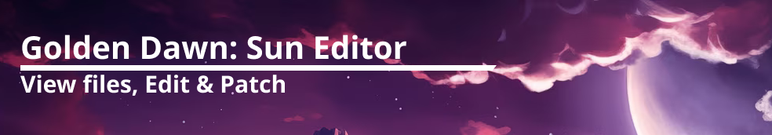
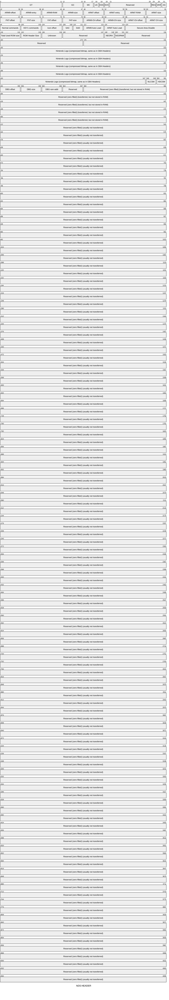

A Editor for Golden Sun: Dark Dawn 

# NDS HEADER

# notes: Apicula might be responible for some of the messed up models (weird proportions) 
it could have something todo with the skeleton matrices

# Current best way to export the most amount of assets so that one can view / extract them with apicula

1. Unpack with Tinke 
2. Unpack with Tinke again
3. Unpack with Tinke AGAIN (No joke)
4. Make sure lzx is installed in the third_party folder (quick setup script needs this to decompress files)
5. run `python ./scripts/quick_setup` 
6. enjoy ( current highest number of viewable models: 4270) some texture bugs

## Tools

- Apicula (Used to view and convert Nintendo asset files)
- Ndstool (Used to unpack the Rom into a folder structure)
- Nintendo_DS_Decompressor (collection of tools used to decompress files)
- Tinke (for unpacking .NARC files)

## Initialize the Project

#### Quick Setup

    ./quick_setup ./ROM/filename.nds

#### 1. Get a Golden Sun: Dark Dawn ROM

You can dump the file from your Legally owned Cardridge

#### 2. Put it in the ROM folder of this project

#### 3. Extract the ROMs datafiles (Assets of the game)

This only gives you the Assets of the ROM, not the Code 

    ndstool -x .ROM/filename.nds -d unpacked_rom/data

#### 4.  

## Helpful Commands

Unpacking a NDS rom 

    ndstool -x file.nds -d ./unpacked

Removing bytes from file (1131 bytes in example)

    dd bs=1 skip=1131 if=filtered.dump of=trimmed.dump

Viewing (most) nintendo 3D/Texture/Animation files

    apicula view <filename,foldername>
View all files in a directory tree using apicula 

    apicula view $(find ./unpacked_rom -type f)

Decompress .cbmdl files (LZX using compression)

    lzx -D filename.cbmdl

Get all file extensions

    find ./data -type f | perl -ne 'print $1 if m/\.([^.\/]+)$/' | sort -u

Get all paths of file with certain extension

    find ./unpacked -type f -name \*.narc
## File Types

### All file Types

|        |        |        |        |        |
|--------|--------|--------|--------|--------|
|.bin    |.cam    |.cbarc  |.cbin   |.cbmdl  |
|.col    |.chr    |.dat    |.dat1   |.dat2   |
|.dat3   |.dat4   |.dat5   |.dat6   |.dat7   |
|.inc    |.inst   |.mdlr   |.narc   |.nbb    |
|.nsbca  |.nsbma  |.nsbmd  |.nsbsd  |.nsbta  |
|.nsbtp  |.nsbtx  |.nsbva  |.sdat   |.sim    |
|.spr    |.xsadl  |

## File Glossary

### .cbmdl

- Compressed file containing Models Textures (maybe Animations?)
- Compressed with LZX (lzx decompression tool works here).
- After decompressing All bytes at the beginning of the file until BMD0 have to be removed 
- deleting the bytes might lead to weird deformations of the model but still works (apicula recognizes it)s
- Can then be viewed/exported with apicula  

### .cbin

- are often paired up with .cbmdl files
- maybe additional data for rendering? 
- maybe stands for compressed binary?
- might be data on where objects are spawned? ./unpacked_rom/flmodel/djinn02.narc/djinn02.narc/djinn02.narc
./unpacked_rom/flmodel/chibi_col_04.narc/niru.narc/niru.narc

### .narc

- Widely used nintendo format
- Stands for Nintendo-archive (files have to be extracted)
- can be extracted with Apicula?! (is nowhere mentioned in the docs i think)
- It needs to be checked if Apicula actually exports everything or only parts (.cbark files are skipped for example)
- can also be extracted with tinke

### .cbark

- Its a NARC Archive file that has compressed (some) files inside!
- some of the files have the same compression used in .cbmdl files (LZ40)
- Some Models have weird Proportions (like very a small head) <- still has to be figured out why

# IMPORTANT NOTE 16 Dec 2023: 

It turns out you can unpack even narc files inside the NITRO file system with tinke. as far as i can see this works only 1 layer deep and after unpacking there are still some narcs left. cbarc files are also not unpacked so it might still be usefull to write a tool for unpacking myself.

you can open the unpacked folder just twice or thrice to unpack the nested narcs but this is really annoying

narcs left after unpacking the entire rom with tinke:

./unpacked_rom/mapdata/wldmap/worldmap.narc/worldobject.narc
./unpacked_rom/mapdata/wldmap/worldmap.narc/worldtex.narc
./unpacked_rom/flmodel/djinn02.narc/djinn02.narc
./unpacked_rom/flmodel/f_tprn_arw.narc/f_tprn_arw.narc
./unpacked_rom/flmodel/chibi_col_04.narc/niru.narc

after unpacking it twice

./unpacked_rom/flmodel/djinn02.narc/djinn02.narc/djinn02.narc
./unpacked_rom/flmodel/chibi_col_04.narc/niru.narc/niru.narc

cbarcs left after unpacking the entire rom with tinke

All 
*Also seems like only enemys are stored in cbarc files.. interesting 
