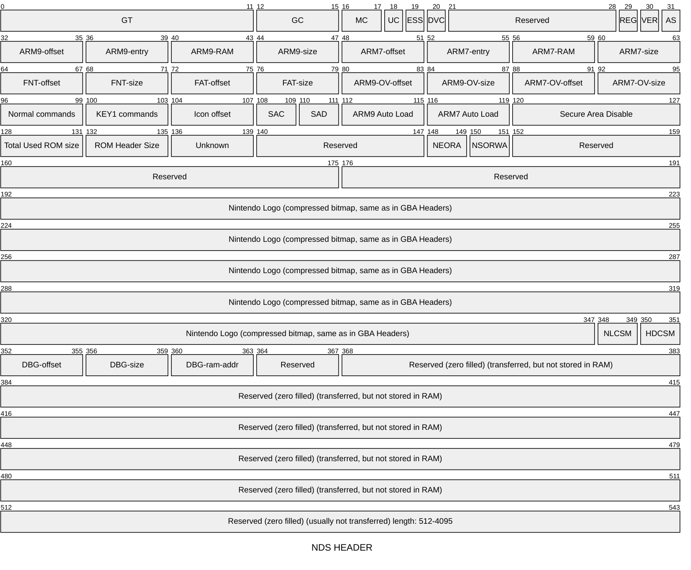
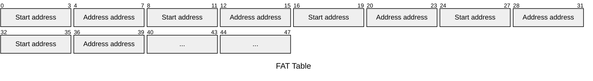
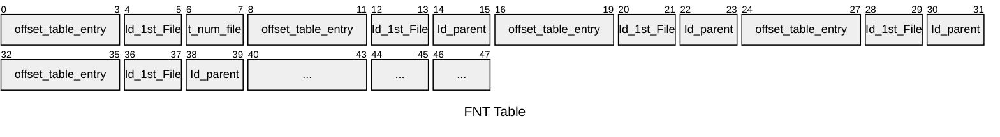
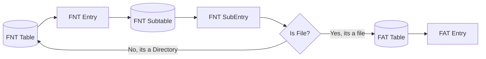

A Editor for Golden Sun: Dark Dawn 

## Apicula

 is an Application for viewing NDS models written in Rust. The Backend of this Application is written in Rust aswell, so maybe i could take some parts of it to display files in my editor (If its OpenSource, have to check).
Apicula displays most of the Models, Textures and Sprites and Animations correctly, there is currently a bug where some models are rendered weirdly when a certain Draw command is used. Here is the Issue: 

https://github.com/scurest/apicula/issues/22

## Tinke

Tinke is a Tool for unpacking a ROM written in C#. Some Folders and Files inside the rom are "archived" multiple times in the NARC format.
By unpacking the folder multiple times it is possible to extract the currently biggest list of files as far as i know ( current highest number of viewable models: 4270).

## LZX

Some Files are compressed using LZ11 this tool can decompress these files 

## NDS Tool

https://github.com/PeterLemon/Nintendo_DS_Compressors

A collection of decompression tools, we need LZX to decompress some files that have are LZ40 compressed. you can identify these files by their first two bytes "0x40" 

# NDS HEADER

Special Thanks to Martin Korth for all the information availiable at: http://problemkaputt.de

This Diagram is just for general overview more info 

## FAT Table

## FNT Table

## How to Read The Entire File System?

## Helpful Commands

Unpacking a NDS rom 

    ndstool -x file.nds -d ./unpacked

Removing bytes from file (1131 bytes in example)

    dd bs=1 skip=1131 if=filtered.dump of=trimmed.dump

Viewing (most) nintendo 3D/Texture/Animation files

    apicula view <filename,foldername>
View all files in a directory tree using apicula 

    apicula view $(find ./unpacked_rom -type f)

Decompress .cbmdl files (LZX using compression)

    lzx -D filename.cbmdl

Get all file extensions

    find ./data -type f | perl -ne 'print $1 if m/\.([^.\/]+)$/' | sort -u

Get all paths of file with certain extension

    find ./unpacked -type f -name \*.narc
## File Types

### All file Types

|        |        |        |        |        |
|--------|--------|--------|--------|--------|
|.bin    |.cam    |.cbarc  |.cbin   |.cbmdl  |
|.col    |.chr    |.dat    |.dat1   |.dat2   |
|.dat3   |.dat4   |.dat5   |.dat6   |.dat7   |
|.inc    |.inst   |.mdlr   |.narc   |.nbb    |
|.nsbca  |.nsbma  |.nsbmd  |.nsbsd  |.nsbta  |
|.nsbtp  |.nsbtx  |.nsbva  |.sdat   |.sim    |
|.spr    |.xsadl  |

## File Glossary

### .cbmdl

- Compressed file containing Models Textures (maybe Animations?)
- Compressed with LZX (lzx decompression tool works here).
- After decompressing All bytes at the beginning of the file until BMD0 have to be removed 
- deleting the bytes might lead to weird deformations of the model but still works (apicula recognizes it)s
- Can then be viewed/exported with apicula  

### .cbin

- are often paired up with .cbmdl files
- maybe additional data for rendering? 
- maybe stands for compressed binary?
- might be data on where objects are spawned? ./unpacked_rom/flmodel/djinn02.narc/djinn02.narc/djinn02.narc
./unpacked_rom/flmodel/chibi_col_04.narc/niru.narc/niru.narc

### .narc

- Widely used nintendo format
- Stands for Nintendo-archive (files have to be extracted)
- can be extracted with Apicula?! (is nowhere mentioned in the docs i think)
- It needs to be checked if Apicula actually exports everything or only parts (.cbark files are skipped for example)
- can also be extracted with tinke

### .cbark

- Its a NARC Archive file that has compressed (some) files inside!
- some of the files have the same compression used in .cbmdl files (LZ40)
- Some Models have weird Proportions (like very a small head) <- still has to be figured out why
